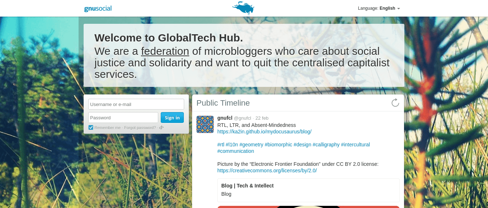

Besides having some external accounts on [federated social networks](https://fediverse.party/en/fediverse/) such as Mastodon, I am also running my own instances on a VPS sever for my digital company. 

One of these instances is dedicated to GNU Social, a social communication software for public and private communications. GNU Social is an old, but robust platform that supports the protocols OStatus and ActivityPub. 

<br />
Picture by Eukombos on [Wikimedia Commons](https://commons.wikimedia.org/wiki/File:Fediverse-high_tech(denoised)(signed).jpg) under [CC BY-SA 4.0](https://creativecommons.org/licenses/by-sa/4.0/deed.en) license

GNU Social comes with some default stable themes. However, the look and feel of those themes is very 90's to me. If you want to give your GNU Social instance a brand-new look, you can use something more exciting such as [Qvitter](https://github.com/hannesmannerheim/qvitter).

I am very happy with Qvitter and its intuitive design. Nevertheless, I wanted to customize the initial welcome text that appears on the main page:

`We are a federation of microbloggers who care about social justice and solidarity and want to quit the centralised capitalist services.`



To modify the text indicated above, go to your site root directory, then navigate to the folder `locale` under the following path:

```console
$ cd plugins/Qvitter/locale 
```
Once in the locale folder, open the file `en.json` with your preferred text editor. In this case, I am using nano:

```console
$ sudo nano en.json 
``` 

Look for the line that starts with `welcomeText`, or use the shortcut `Ctrl-W` in your terminal to search for the text.

Replace with the text you would like to see on your welcome screen. 😎 The result should look like this:


If you want to learn more about the fediverse, you can also read my other blog article on the topic: [Random Thoughts About the Federation/Fediverse](https://globaltech-translations.com/profil/blog/random-thoughts-about-the-federation-fediverse).


Copyright © GlobalTech Translations 2002.
