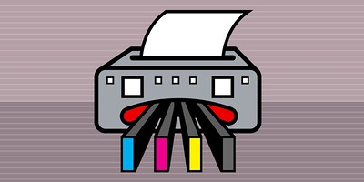

:::note

The following blog post is a self-reminder for troubleshooting Linux distros when access to `graphical mode` is not possible.

:::

I recently messed up the [SELinux configuration](https://www.redhat.com/en/topics/linux/what-is-selinux) on a Fedora distro while trying to relabel the filesystem on boot with this command:

```bash
fixfiles -B onboot
```

After running the command and restarting the OS, the relabeling process was failing repeatedly, leading my system to an infinite reboot loop.

<br />
Picture by the [Electronic Frontier Foundation](https://www.eff.org/) under [CC BY 2.0](https://creativecommons.org/licenses/by/2.0/) license

To fix this issue, I had to boot into **text-only mode** and change the SELinux mode temporarily from `Enforced` to `Disabled`.

Here are the steps to boot into text-only mode:

1. Restart the system to access the GRUB menu.
2. Select the kernel version that you want to boot into, then press the `e` key instead of `Enter` to edit the desired version.
3. Scroll down until you reach the `quiet` parameter. Next, add a white space and number three `3` just after the quiet parameter (i.e., quiet 3).
Here is a full example:

```bash
kernel /vmlinuz-2.6.9-1.667 ro root=LABEL=/ acpi=on rhgb quiet 3
```
4. Press `Ctrl+X` to start
5. The system will boot into the new runlevel this time only.

:::info

A runlevel is a number indicating what "mode" you want the system to boot into. For instance, runlevel 3 is text-only mode, while runlevel 5 refers to graphical mode.

:::

---

## About Farowave

At Farowave, we work with both Sphinx and Docusaurus across our documentation engagements — from enterprise API reference builds and docs-as-code retainers to localization governance and TMS workflow design. If you're evaluating documentation tooling for your organization, or need help structuring a documentation system that scales, [get in touch](https://farowave.com).